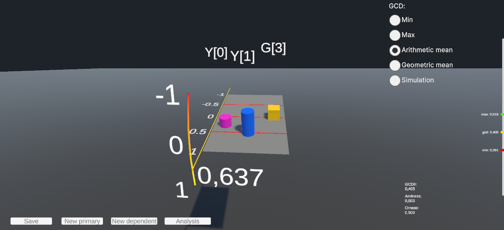
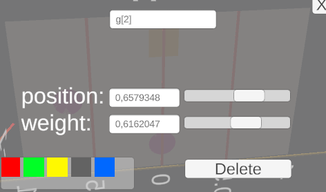
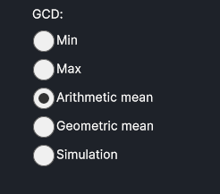
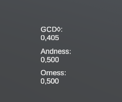

# Использование

## Описание

Данная физическая симуляция является полнофункциональным прототипом физической модели баланса, представленной в статье [[1]](#ссылки) для визуализации операторов агрегирования. Симуляция представляет из себя абсолютно упругую плоскость, закрепленную на опорах вдоль плоскости. Плоскость имеет одну степень свободы - это отклонение ее относительно поверхности. Отклонение плоскости ограничено и угол ее отклонения приведен к диапазону $[0, 1]$.  

На плоскости располагаются критерии $Y_1, \dots, Y_n$, представленные цилиндрами. Для критериев определены такие характеристики как вес $w_i$ и положение $y_i$ на оси, перпендикулярной оси плоскости.
Также на плоскости размещаются зависимые критерии $G_1, \dots, G_n$ (представленные призмами), положение которых выражается некоторой заданной функцией $f_i(y_1,\dots, y_n)$ ,  и заданным весом $g_i$.

Также данная система была оснащена метриками *andness* и *orness*, а также возможностью выбора и моделирования *Graded conjunction/disjunction (GCD)* из [[2]](#ссылки).

 \
*Внешний вид физической симуляции симуляции*

## Интерфейс

### Плоскость

По центру рабочей области находится плоскость, на плоскости распологаются критерии.

Над каждым критерием высвечено его имя (в случае наведения курсора мыши выводится его весовая характеристика и положение вдоль перпендикулярной оси плоскости относительно ее центра, в диапазоне $[-1,1]$).

С одной стороны плоскости находятся 2 шкалы (шкала $y$ и шкала нормированного угла). Вдоль шкалы угла перемещается текущий показатель отклонения плоскости относительно горизонтали.

### Интерфейс критериев

При двойном нажатии на критерий откроется интерфейс цилиндра, в котором можно:

- Задать критерию имя
- Установить позицию критерию (конкретным значением, либо через ползунок)
- Установить значение веса критерию (конкретным значением, либо через ползунок)

При работе с зависимыми критериями будет также содержаться дополнительное поле для формулы, подробнее в разделе [функциональная зависимость](#функциональная-зависимость).

### Кнопки взаимодействия

 \
Снизу рабочей области расположены интерактивные кнопки для работы с физической симуляцией, ниже представлно описание каждой кнопки.

|Кнопка|Действие|
|------|--------|
|**Save**|Сохраняет текущую симуляцию(положение, цвета и веса критериев) в локальное key-value хранилище Unity для автоматической загрузки при следующем запуске|
|**New primary**| Создает новый критерий $Y_i$ (цилиндр) и автоматически присваивает ему уникальное имя (можно изменить)|
|**New depended**| Создает новый зависимый критерий $G_i$ (призма) и автоматически присваивает ему уникальное имя (можно изменить)|
|**Analysis**| Открывает меню численного расчета метрик|

### Выбор GCD

\
В верхнем правом углу находится список radio-button выборов вида *GCD*, из [[2]](#ссылки), его выбор влияет на расчет [метрик](#метрики), а также на [проекционную шкалу](#проекционная-шкала). В случае выбора пункта **Simulation** *GCD* будет рассчитываться исходя из нормированного угла наклона физической симуляции. Остальные случаи представлены в таблице.

|Форма GCD| Функция расчета|
|---------|----------------|
|Min| $min(y_1,\dots,y_n)$|
|Max| $max(y_1,\dots,y_n)$|
|Arithmetic mean| $\frac{1}{2} [min(y_1,\dots,y_n) + max(y_1,\dots,y_n)]$|
|Geometric mean| $\sqrt{min(y_1,\dots,y_n) \cdot max(y_1,\dots,y_n)}$|

Подробнее о рассчете можно найти в разделе [рассчет метрик](#рассчет-метрик).

### Метрики

 \
Рассчет *GCD*, *Andness* и *Orness* происходит исходя из выбранного вида *GCD*. Подробнее в [рассчете метрик](#рассчет-метрик).

### Проекционная шкала

 \
 Справа в рабочей области представлена проекционная шкала, которая отображает на себе:

- элемент *дизъюнкции* ( $max(y_1, \dots, y_n)$ ), отмеченный как **max**
- элемент *конъюнкции* ( $min(y_1, \dots, y_n)$ ), отмеченный как **min**
- *GCD*, рассчитанный исходя из выбранной формы.

## Рассчет угла

Рассчет угла происходит согласно формуле:

$$
angle = \sum_{i=1}^n y_i \cdot w_i + \sum_{i=1}^n f_i(y_1,\dots,y_n) \cdot g_i
$$

Данный угол подвергается обрезанию (clamping) до диапазона $[0,1]$ для дальнейшей обработки.

## Рассчет метрик

Метрики *Andness* и *Orness* задаются следующими выражениями:

$$
A = \vee x_1 \vee \dots \vee x_n - GCD
$$
$$
B = GCD - \wedge x_1 \wedge \dots \wedge x_n
$$
$$
\text{Andness} = \frac{A}{A+B}
$$
$$
\text{Orness} = \frac{B}{A+B}
$$

И напрямую зависят от выбранной формы *GCD*. Ниже представлено графическая интерпритация формул из [[2]](#ссылки)

## Функциональная зависимость

# Разработка

# Ссылки

1. Сакулин С. А. Визуализация операторов агрегирования с применением трехмерной когнитивной графики //
Вестник компьютерных и информационных технологий. 2022. Т. 19, № 3. C. 15 – 22. DOI 10.14489/vkit.
2022.03.pp.015-022
2. Dujmovic, J. *Soft Computing Evaluation Logic: The LSP Decision Method and Its Applications*. IEEE Press; John Wiley & Sons, 2018. 912 p. ISBN 111925647X, 9781119256472.
