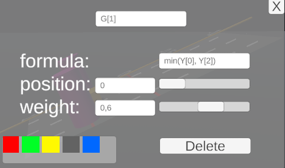

# Использование

## Описание

Данная физическая симуляция является полнофункциональным прототипом физической модели баланса, представленной в статье [[1]](#ссылки) для визуализации операторов агрегирования. Симуляция представляет из себя абсолютно упругую плоскость, закрепленную на опорах вдоль плоскости. Плоскость имеет одну степень свободы - это отклонение ее относительно поверхности. Отклонение плоскости ограничено и угол ее отклонения приведен к диапазону $[0, 1]$.  

На плоскости располагаются критерии $Y_1, \dots, Y_n$, представленные цилиндрами. Для критериев определены такие характеристики как вес $w_i$ и положение $y_i$ на оси, перпендикулярной оси плоскости.
Также на плоскости размещаются зависимые критерии $G_1, \dots, G_n$ (представленные призмами), положение которых выражается некоторой заданной функцией $f_i(y_1,\dots, y_n)$ ,  и заданным весом $g_i$.


Также данная система была оснащена метриками *andness* и *orness*, а также возможностью выбора и моделирования *Graded conjunction/disjunction (GCD)* из [[2]](#ссылки).

 \
*Внешний вид физической симуляции симуляции*

## Интерфейс

### Плоскость

По центру рабочей области находится плоскость, на плоскости распологаются критерии.

Над каждым критерием высвечено его имя (в случае наведения курсора мыши выводится его весовая характеристика и положение вдоль перпендикулярной оси плоскости относительно ее центра, в диапазоне $[-1,1]$).

С одной стороны плоскости находятся 2 шкалы (шкала $y$ и шкала нормированного угла). Вдоль шкалы угла перемещается текущий показатель отклонения плоскости относительно горизонтали.

### Интерфейс критериев


При двойном нажатии на критерий откроется интерфейс цилиндра, в котором можно:

- Задать критерию имя
- Установить позицию критерию (конкретным значением, либо через ползунок)
- Установить значение веса критерию (конкретным значением, либо через ползунок)

При работе с зависимыми критериями будет также содержаться дополнительное поле для формулы, подробнее в разделе [функциональная зависимость](#функциональная-зависимость).

### Кнопки взаимодействия

 \
Снизу рабочей области расположены интерактивные кнопки для работы с физической симуляцией, ниже представлно описание каждой кнопки.

|Кнопка|Действие|
|------|--------|
|**Save**|Сохраняет текущую симуляцию(положение, цвета и веса критериев) в локальное key-value хранилище Unity для автоматической загрузки при следующем запуске|
|**New primary**| Создает новый критерий $Y_i$ (цилиндр) и автоматически присваивает ему уникальное имя (можно изменить)|
|**New depended**| Создает новый зависимый критерий $G_i$ (призма) и автоматически присваивает ему уникальное имя (можно изменить)|
|**Analysis**| Открывает меню численного расчета метрик|

### Выбор GCD

\
В верхнем правом углу находится список radio-button выборов вида *GCD*, из [[2]](#ссылки), его выбор влияет на расчет [метрик](#метрики), а также на [проекционную шкалу](#проекционная-шкала). В случае выбора пункта **Simulation** *GCD* будет рассчитываться исходя из нормированного угла наклона физической симуляции. Остальные случаи представлены в таблице.

|Форма GCD| Функция расчета|
|---------|----------------|
|Min| $min(y_1,\dots,y_n)$|
|Max| $max(y_1,\dots,y_n)$|
|Arithmetic mean| $\frac{1}{2} [min(y_1,\dots,y_n) + max(y_1,\dots,y_n)]$|
|Geometric mean| $\sqrt{min(y_1,\dots,y_n) \cdot max(y_1,\dots,y_n)}$|

Подробнее о рассчете можно найти в разделе [рассчет метрик](#рассчет-метрик).

### Метрики

 \
Рассчет *GCD*, *Andness* и *Orness* происходит исходя из выбранного вида *GCD*. Подробнее в [рассчете метрик](#рассчет-метрик).

### Проекционная шкала

 \
 Справа в рабочей области представлена проекционная шкала, которая отображает на себе:

- элемент *дизъюнкции* ( $max(y_1, \dots, y_n)$ ), отмеченный как **max**
- элемент *конъюнкции* ( $min(y_1, \dots, y_n)$ ), отмеченный как **min**
- *GCD*, рассчитанный исходя из выбранной формы.

## Рассчет угла

Рассчет угла происходит согласно формуле:

$$
angle = \sum_{i=1}^n y_i \cdot w_i + \sum_{i=1}^n f_i(y_1,\dots,y_n) \cdot g_i
$$

Данный угол подвергается обрезанию (clamping) до диапазона $[0,1]$ для дальнейшей обработки.

## Рассчет метрик

Метрики *Andness* и *Orness* задаются следующими выражениями:

$$
A = \vee x_1 \vee \dots \vee x_n - GCD
$$
$$
B = GCD - \wedge x_1 \wedge \dots \wedge x_n
$$
$$
\text{Andness} = \frac{A}{A+B}
$$
$$
\text{Orness} = \frac{B}{A+B}
$$

И напрямую зависят от выбранной формы *GCD*. Ниже представлено графическая интерпритация формул из [[2]](#ссылки)


## Функциональная зависимость
Зависимые критерии (призмы) позволяют задавать им функциональную зависимость от $y_i$.



Для зависимых критериев поле *position* не является функциональным и их положение напрямую задается формулой.
В данном примере положение критерия будет соответствовать формуле $g_1 = min(y_0, y_1)$.
Для получения позиции критерия необходимо записать его полное имя (например $Y[1]$ или любое введенное пользователем наименование, [подробнее](#интерфейс-критериев)).

### Операции

|Название операции|Тип|Семантика|Пример|
|---------|-----|----|----|
|Сложение|Бинарная| L + R | $2 + Y[1]$|
|Вычитание|Бинарная| L - R | $1 - Y[4]$|
|Умножение| Бинарная| L * R| $0.35*Y[4]$|
|Деление| Бинарная| L / R| $Y[4]/2$|
|Унарный минус| Унарная| - R| $-Y[2]$|
|Возведение в степень| Бинарная| L^R| $1$ ^ $Y[1]$|

> [!important] Важно
>
> 1. Десятичным разделителем является точка (.)
> 2. Разделителем аргументов функций является запятая (,)
> 3. Необходимо явно указывать умножение (*)
> (пример $2.214 * Y[1]$, при написании  $2.214Y[1]$ будет синтаксическая ошибка)
> 4. Приоритетность выполнения операций соотвествует алгебраическим правилам:
    1. Возведение в степень\
    2. Умножение\
    3. Деление\
    4. Сложение/Вычитание

### Скобки
Для задания приоритета операциям и отдельным блокам формулы возможно использовать скобки, также одинаковые скобковые выражения в одной формуле будут интерпретированы единожды, что повышает скорость интерпритации выражений.

На текущий момент в качестве скобок возможно использовать лишь "(" и ")". Все остальные виды скобок будут интерпритироваться как текст.

### Функции
Явно обьявленные в коде программы функции могут быть использованы при интерпритации формул, подробнее про реализацию и добавление функций в разделе [Реализация формул](#реализация-формул).

#### Реализованные функци

|Формула| Количество операндов |Математический смысл|
|--|--|--|
|sin(A)|1| $\sin(A)$|
|cos(A)|1| $\cos(A)$|
|tan(A)|1| $\tan(A)$|
|exp(A)|1| $e^{A}$|
|sqrt(A)|1| $\sqrt{A}$|
|max($A_1$, ...)| >1| $\max(A_0, \dots, A_n)$|
|min($A_1$, ...)| >1| $\min(A_0, \dots, A_n)$|
|mean($A_1$, ...)| >1| $\frac{1}{n} \sum_i^n(A_i)$|
|abs(A)| 1| $\|A\|$|

В качестве аргументов функции могут выступать значения критериев, константы, а также целые выражения в т.ч. другие формулы.

# Разработка

В данном разделе описаны основные части программного кода и приведены примеры их модификации.

Все файлы с программным кодом находятся в директории **Assets/Scripts**.

## Реализация панели

Логика работы панели (рассчет угла наклона, добавление цилиндров на панель, удаление цилиндров, вызов обработки загрузки и вызов обработки сохранения) реализована в файле [Panel.cs](Assets/Scripts/Panel.cs).

### Расчет угла
Рассчет угла реализован в методе **CalculateAngle**
```csharp
private float CalculateAngle()
    {
        var angle = 0.0f;
        foreach (var cyl in _cylinders)
        {
            float dist = (float)cyl.GetPos();
            angle += (dist) * cyl.GetMass();
        }
        return Mathf.Clamp(angle, 0, 1);
    }

```
Данный угол принимает значения в диапазоне $[0,1]$ Для правильного наклона используется коэффициент `float _maxAngleOffset` и обновляется во встроенной в Unity функции `Update()`

Для добавления цилиндров реализованы методы `AddNewCylinder()` и `AddDependedCylinder()`, а также их перегруженные параметризованные версии `AddNewCylinder(Saver.LogicalCylinder logicalCylinder)` и `AddDependedCylinder(Saver.DependedLogicalCylinder dependedLogicalCylinder)`, используемые при загрузке/выгрузке состояния.

```csharp
    public Cylinder AddNewCylinder()
    {
        var obj = Instantiate(_cylinder, transform);
        _cylinders.Add(obj);
        obj.SetPos(0);
        obj.name = GetNewPrimaryName();

        AddLine();
        Resize();
        return obj;
    }
```

```csharp
    public Cylinder AddNewCylinder(Saver.LogicalCylinder logicalCylinder)
    {
        var obj = Instantiate(_cylinder, transform);
        _cylinders.Add(obj);
        obj.SetMass(logicalCylinder.Mass);
        obj.SetPos(logicalCylinder.Position);
        obj.name = logicalCylinder.Name;
        obj.SetColor(logicalCylinder.color);

        AddLine();
        Resize();
        return obj;
    }
```

```csharp
    public DependedCylinder AddDependedCylinder()
    {
        var obj = Instantiate(_dependedCylinder, transform);
        _cylinders.Add(obj);
        obj.SetFormula("0");
        obj.name = GetNewDependedName();

        AddLine();
        Resize();
        return obj;
    }
```

```csharp
    private DependedCylinder AddDependedCylinder(Saver.DependedLogicalCylinder dependedLogicalCylinder)
    {
        var obj = Instantiate(_dependedCylinder, transform);
        _cylinders.Add(obj);
        obj.SetFormula(dependedLogicalCylinder.Formula);
        obj.name = dependedLogicalCylinder.Name;
        obj.SetMass(dependedLogicalCylinder.Mass);
        obj.SetColor(dependedLogicalCylinder.color);

        AddLine();
        Resize();
        return obj;
    }
```

## Реализация цилиндров

## Реализация метрик

## Реализация формул

## Реализация сохранения

## Реализация интерфейса

# Ссылки

1. Сакулин С. А. Визуализация операторов агрегирования с применением трехмерной когнитивной графики //
Вестник компьютерных и информационных технологий. 2022. Т. 19, № 3. C. 15 – 22. DOI 10.14489/vkit.
2022.03.pp.015-022
2. Dujmovic, J. *Soft Computing Evaluation Logic: The LSP Decision Method and Its Applications*. IEEE Press; John Wiley & Sons, 2018. 912 p. ISBN 111925647X, 9781119256472.
